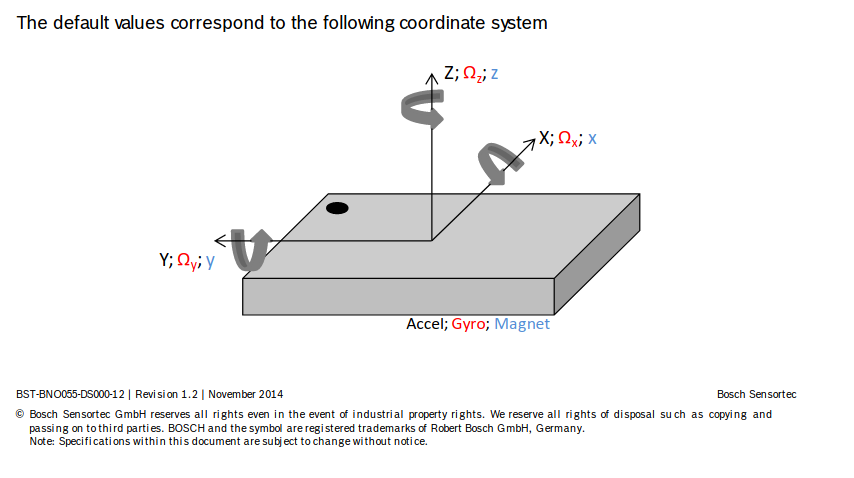
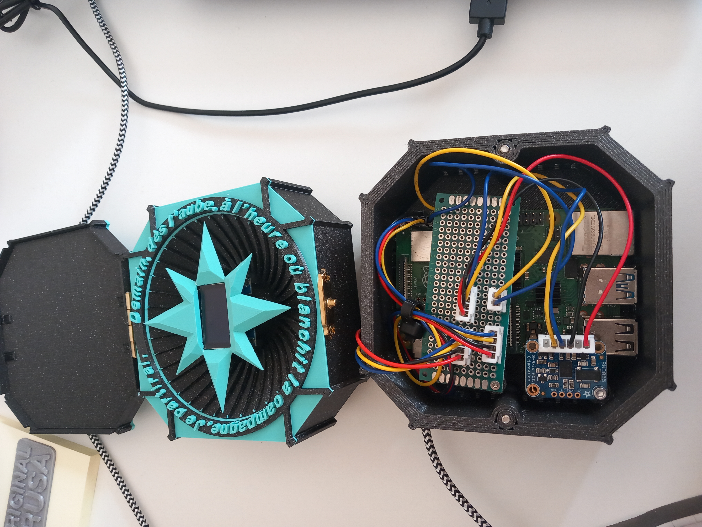
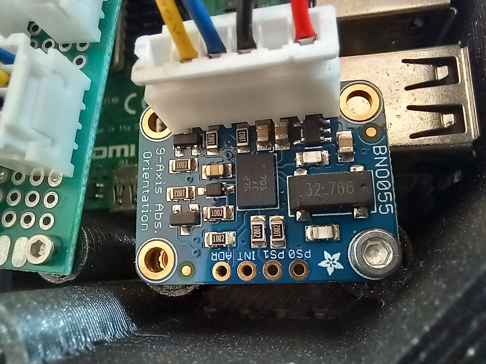
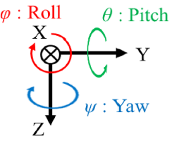
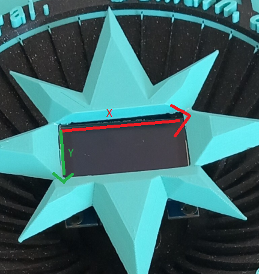

# imu_visualizer
a repo to read imu messages from a filter via websockets, serialized with protobuffer, and visualize the orientation on a pixel grid, outputting to an oled via i2c.


```
sudo docker run -it --device /dev/i2c-3 --device /dev/mem --privileged --entrypoint=/bin/bash oled
```

js example
```
docker run -it -p 8000:8000 --entrypoint=/bin/bash oled
cd /repo/http_example
http-server -p 8000
```

dtparam=i2c_arm=on,i2c_arm_baudrate=1000000
dtparam=spi=on

dtoverlay=i2c-gpio,i2c_gpio_sda=4,i2c_gpio_scl=5,i2c_gpio_delay_us=2,bus=3

## Cordinate Systems

Datasheet for sensor is [here](https://cdn-shop.adafruit.com/datasheets/BST_BNO055_DS000_12.pdf). We can see our sensor's default coordinate system in the PDF.   


Note we have mounted the sensor as per below:  




Our filter model has the below coordinate system:  
  
Fig 1, Saito, A., Kizawa, S., Kobayashi, Y. et al. Pose estimation by extended Kalman filter using noise covariance matrices based on sensor output. Robomech J 7, 36 (2020). https://doi.org/10.1186/s40648-020-00185-y

Whereas our screen has this coordinate system:  
  